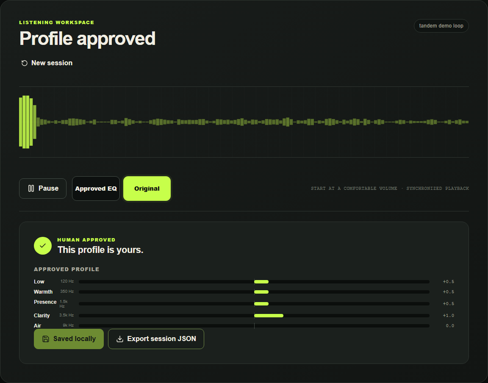

# tandem

Compare EQ settings, hear the difference, and keep the sound you prefer.

**[Open tandem](https://tandem-listening-lab.alx21.chatgpt.site)** · [WebMCP guide](WEBMCP.md) · [Report a problem](https://github.com/agammann/tandem-webmcp/issues)

tandem is a browser listening tool. It plays one audio source through two synchronized EQ paths, randomly labels them A and B, and hides their settings until you record a preference. Use the built-in guided comparisons or let a WebMCP-capable browser agent design comparisons from your feedback. No account or API key is required by tandem.



## Try it

1. Open the app and choose **Load demo audio** or **Choose local file**. Use headphones or speakers at a comfortable volume.
2. Choose **Try a guided comparison**, then **Play audio**. Switch between **A** and **B** while listening.
3. Select **Prefer A**, **Prefer B**, or **No preference**. Add optional tags or a note, then choose **Record my feedback**. Both versions must have been played before the button becomes available.
4. Complete another comparison. Choose **Review a suggested profile**, then compare **Proposal** with **Original**.
5. Approve the profile if you prefer it, or reject it and keep testing. **Save approved profile** marks it saved in this browser. **Export session JSON** downloads the settings and feedback for your records.

**Reject** and **Request another test** immediately restore the original audio processing while keeping your completed trials.

The guided mode uses fixed comparison pairs. Its final suggestion averages your chosen profiles and rounds to 0.5 dB; a no-preference vote contributes the unchanged profile. This is a starting point to review, not a prediction of your ideal sound. An agent can use your recorded settings and notes to design different follow-up comparisons.

## What you get

- Real Web Audio processing with five EQ bands, bounded to −6…+6 dB in 0.5 dB steps.
- A synchronized source, short switching crossfades, and shared output headroom across A/B/Original.
- Trial history showing the settings behind each recorded choice.
- Local session recovery, an explicit **New session** confirmation, and JSON export.
- Four page tools that let an agent read the same session and stage comparisons and proposals.
- A complete guided workflow when the browser has no WebMCP support.

**Scope:** EQ applies only to playback inside tandem. It does not change your computer’s audio settings, process other apps, export edited audio, or provide a system EQ preset. JSON export is a record; importing it is not supported. “Blind” means the interface and agent state hide the pending mapping, not that a person inspecting browser storage cannot find it. This is a preference tool, not a hearing test or scientifically calibrated loudness comparison. EQ can change perceived loudness, and two trials cannot establish a universally better profile.

## Your audio and saved progress

Audio is synthesized or decoded on your device. tandem does not upload it. Local files must be supported by your browser, at most **50 MiB**, and no longer than **10 minutes**. WAV and MP3 are useful starting formats; codec support varies by browser. The decoded clip loops during playback.

Session settings and feedback are saved automatically in this browser’s local storage. Audio is not saved. After refreshing, reload the demo or choose the same local file to continue the existing session. New local-file sessions store a local SHA-256 fingerprint to reject a different track during recovery. Older sessions without a fingerprint cannot make that check. Neither filenames nor fingerprints are exposed to the agent or included in exports.

**New session** replaces the saved session after confirmation. Export first if you want to keep its history. Clearing browser site data also removes saved progress. Use one tab per session; simultaneous editing across tabs is not supported. See [Privacy](PRIVACY.md).

## Use with a browser agent

Open tandem in a browser that supports the current `document.modelContext.registerTool` API and provides an agent that can access page tools. The header reports **Agent tools available** only after registration succeeds. This does not mean every assistant or browser can use WebMCP. Ordinary browsers can use the guided controls.

WebMCP is experimental. Chrome 154 needs WebMCP enabled in `chrome://flags/#enable-webmcp`, followed by a browser restart. Automated checks use `--enable-features=WebMCP`. See [Chrome's WebMCP guide](https://developer.chrome.com/docs/ai/webmcp). Native discovery and all four tool calls have been verified on Chrome 154, Edge 154 and Chrome for Testing 155.0.8059.12. The v1 source checks also pass on Chrome 155.0.8059.39. Recheck compatibility when adopting newer builds.

Load audio, then ask your agent:

> Read tandem’s listening skill and current state. Stage a small blind comparison. Wait for me to listen and vote, then use my recorded preferred settings and notes to choose the next comparison. After at least two trials, propose a profile for me to review.

| Tool | Purpose |
| --- | --- |
| `skill_calibrate_listening` | Read the workflow, EQ bands, limits, and human decisions |
| `get_calibration_state` | Read the current revision, completed feedback, preferred settings, and available actions |
| `stage_ab_trial` | Stage two distinct EQ candidates as a randomized comparison |
| `stage_final_profile` | Propose a profile after at least two completed trials |

Playback, listening, voting, approval, save, and export remain in the interface. There is no remote MCP server to connect. See [the WebMCP guide](WEBMCP.md) for inputs, recovery, and an example.

## Stable source release

Download `tandem_1.0.0_source.zip` from [Releases](https://github.com/agammann/tandem-webmcp/releases). Verify it against `SHA256SUMS` before extracting. The ZIP contains the MIT license, frozen dependencies, source, and the developer guides. In PowerShell use `Get-FileHash .\tandem_1.0.0_source.zip -Algorithm SHA256`; on Linux use `sha256sum -c SHA256SUMS`.

Open the extracted folder containing `package.json`, then run `pnpm install --frozen-lockfile`, `pnpm build`, and `pnpm preview`. Use the same browser profile and origin when updating; browser storage belongs to that origin. Keep the previous source folder until the new version has loaded your saved session and original audio. The public hosted app is maintained separately from this source release. See [the v1 support and recovery contract](docs/STABILITY.md).

## Run locally

Requirements: **Node.js 24.15+** and **pnpm 11.19.0**. CI uses Node 24; the test environment requires a recent Node release.

```bash
git clone https://github.com/agammann/tandem-webmcp.git
cd tandem-webmcp
pnpm install --frozen-lockfile
pnpm dev
```

Open `http://localhost:3000`. No environment variables, cloud account, backend, or database are needed.

```bash
pnpm build
pnpm preview
```

The production files are in `dist/client`. Serve that directory from a static HTTPS host at the site root. `pnpm preview` is for checking the build locally. `.openai/hosting.json` points to the maintained public Site; do not reuse its project ID when deploying your own copy.

## Verify changes

```bash
pnpm typecheck
pnpm lint
pnpm security:audit
pnpm test
pnpm build
pnpm exec playwright install chromium
pnpm test:e2e
pnpm exec playwright install chrome
pnpm test:webmcp
```

Vitest covers EQ limits, shared headroom, revisions, idempotency, session recovery, feedback mapping, registration failure and late registration completion. The seven ordinary Playwright checks use real browser audio nodes. They cover approval/export, reload recovery, local-file errors and identity, mobile layout, restoration after rejecting a proposal, and measured output differences from a decoded 350 Hz clip.

The five native checks use actual browser discovery and execution for all four tools, input and revision refusal, explicit approval controls, saved-session recovery, and page lifecycle restoration. Tools withdraw on `pagehide` and reconnect after a cached `pageshow`. Automated votes are scripted test input, not listening evaluations; the app cannot establish that someone heard or preferred a sound.

Run the browser suites one at a time after building. The native suite starts a separate production preview. In PowerShell, `$env:TANDEM_WEBMCP_CHANNEL = 'msedge'` selects Edge; `TANDEM_WEBMCP_BROWSER` selects an absolute executable path. `TANDEM_WEBMCP_URL` selects an existing deployment. Browser tests use isolated sessions with fictional feedback.

The GitHub workflow runs these checks, verifies an independent clean consumer of the packaged ZIP, and retains native JSON results. Only a successful main push can publish a source release; the publisher verifies the current commit, tag, asset checksums, and complete asset set. Changes to browser support should also be checked in a connected browser agent.

## Contributing

For a bug report, include the browser/version, steps, expected result, and actual result. Mention whether you used guided mode or an agent. Avoid attaching private audio or personal notes. Small focused fixes are welcome.

Built with React, TypeScript, Vite, Zustand, Zod, and the Web Audio API. See [accessibility notes](ACCESSIBILITY.md) and [attribution](ATTRIBUTION.md). Licensed under [MIT](LICENSE).
